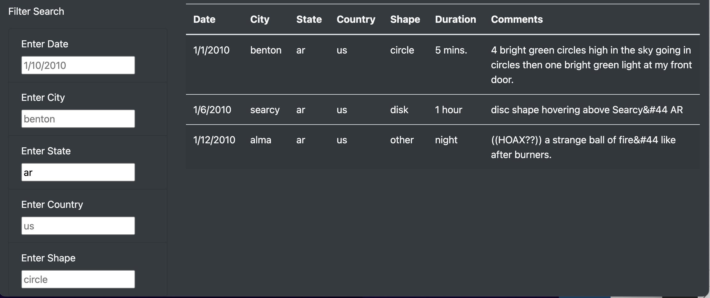
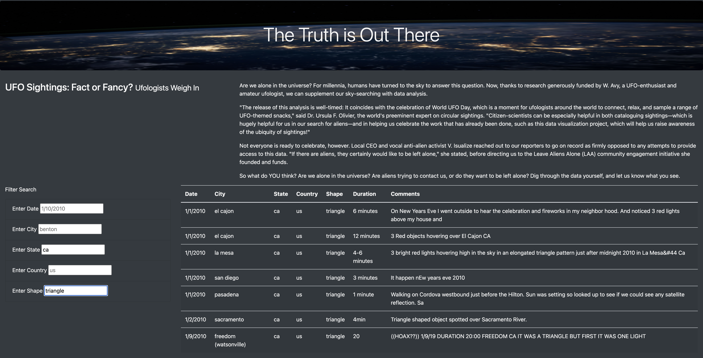

# UFOs
## Overview 
In this project we created a webpage where users can visit, search and filter our data of UFO sightings. Users will be able to filter through five categories: date, city, state, country, and shape. In addition to these filters, our table data also provides information on duration and comments.
### Purpose 
The purpose of this project was to provide a clear and clean webpage that is easy to read. The webpage will also provide filters as a way to sort through the large amount of data collected and be available to anyone.

## Results 
### Single filter
This webpage will be useful for someone who already has knowledge of a specific UFO sighting and wishes to know more about that sighting. The user can input what information they know into one of the provided filters and the datatable will provide all the information we have.

### Multiple filters 
The user will also be able to narrow their search by applying multiple filters. For instance, if they know the sighting occurred in California and only want to see a particular kind of sighting, such as those shaped like triangles, they can utilize both filters to narrow their search.

## Summary
- One drawback of this design is that the data entered to filter the table is very specific, such as capitalization. For example, if the user were to input "Bonita" instead of "bonita", the table would not return any data.
- One recommendation would be to include a code that automatically decapitalizes the input data so our function can find the information.
- Another recommendation would be to provide ranges or examples for the filters so if the user wants to explore more options, they know what's available instead of having to guess. For example, in our shape filter, they could search 'round' and find nothing; but if they search 'disk', they will find data.
- A final recommendation would be more options for inputting dates so users can search for either a single date, an entire month or even year.